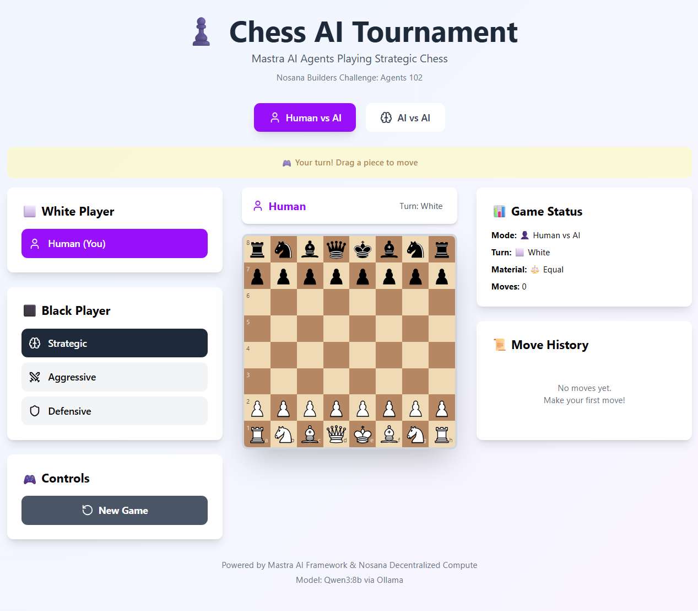

# ♟️ MastraChess AI Tournament

**Nosana Builders Challenge #3: AI Agents 102**




## 🏆 Challenge Submission Details

**Project Name**: MastraChess AI Tournament  
**Repository**: [https://github.com/alcyonect-coder/agent-challenge](https://github.com/alcyonect-coder/agent-challenge)  
**Docker Image**: alcyone864/agent-challenge:latest  
**Video Demo**: https://youtu.be/YzQ4dGcnbmE?si=ZOY_N1BwAkkIKYKd  
**Twitter**: https://x.com/Alcyone_x/status/1980417117456592906  
**Solana Address**: 6THQP83GfxJQkKXoXakip7YLub2JV1G14YyxeZnoLzs7  
**Deployer address**: E6AdyzNkH9ivdn5uaF8BMFUyFesmfJpoedX2BpQYxKC2  
**Host address**: DqY4tVVpM7GtFihR1rNize344L1yV5vePSGUu2n3RU6m  
**Nosana Deployment Proof:**: https://2ycnv9zov3plfamfzmaxkt3qq7lkdengzgskuvrtkc5m.node.k8s.prd.nos.ci/

---

## 📦 Project Overview

**MastraChess AI Tournament** is an interactive, full-stack chess application where **AI agents compete against each other or play against humans**. Built with **Next.js 15**, the **Mastra AI framework**, and powered by **Nosana's decentralized GPU compute network**, this project showcases sophisticated multi-agent orchestration in a real-time strategic game environment.

### 🎯 Key Features

- **Three Distinct AI Personalities**: Strategic, Aggressive, and Defensive agents with unique decision-making philosophies
- **Human vs AI Mode**: Play against any of the three AI agents with your preferred playstyle
- **AI vs AI Mode**: Watch autonomous agent battles with real-time move reasoning
- **Smart Pawn Promotion**: Visual piece selection interface (Queen, Rook, Bishop, Knight)
- **Live Game Analysis**: Real-time material evaluation, check detection, and move history
- **Modern Tech Stack**: Next.js 15, TailwindCSS 4, Mastra Framework, Bun runtime
- **Production-Ready Docker Deployment**: Multi-stage builds optimized for Nosana network

---

## 🏗️ Architecture

### **Directory Structure**

```
mastra-chess/
├── src/
│   ├── app/
│   │   ├── api/
│   │   │   └── chess-move/
│   │   │       └── route.ts          # AI move generation endpoint
│   │   ├── favicon.ico
│   │   ├── globals.css               # TailwindCSS styles
│   │   ├── layout.tsx                # Root layout
│   │   └── page.tsx                  # Main chess UI & game logic
│   │
│   ├── components/
│   │   ├── CustomChessBoard.tsx      # Interactive drag-and-drop board
│   │   └── ui/
│   │       └── button.tsx            # Reusable UI components
│   │
│   ├── lib/
│   │   ├── chess/
│   │   │   ├── ChessEngine.ts        # Chess.js wrapper with utilities
│   │   │   └── types.ts              # TypeScript definitions
│   │   └── utils.ts                  # Helper functions
│   │
│   └── mastra/
│       ├── agents/
│       │   ├── aggressiveAgent.ts    # "The Berserker" - tactical attacker
│       │   ├── defensiveAgent.ts     # "The Fortress" - prophylactic defender
│       │   └── strategicAgent.ts     # "The Architect" - positional master
│       ├── tools/
│       │   ├── analyzePositionTool.ts # Position evaluation tool
│       │   ├── suggestMoveTool.ts     # Move suggestion tool
│       │   └── index.ts
│       ├── mcp/
│       │   └── index.ts              # Model Context Protocol setup
│       └── index.ts                  # Mastra instance initialization
│
├── public/
│   └── pieces/                       # Chess piece SVG assets
│
├── .env                               # Environment configuration
├── .dockerignore
├── Dockerfile                         # Multi-stage production build
├── nosana_mastra_job_definition.json  # Nosana deployment config
├── package.json
├── bun.lockb
├── tsconfig.json
└── README.md
```

---

## 🧠 AI Agent Personalities

### **1. The Strategic Agent ("The Architect")**

- **Philosophy**: Long-term positional mastery through accumulated advantages
- **Strengths**: Pawn structure optimization, space control, piece coordination
- **Style**: Methodical, patient, converts small edges into decisive wins
- **Best Against**: Opponents who lack a clear plan

### **2. The Aggressive Agent ("The Berserker")**

- **Philosophy**: Relentless king attacks and tactical aggression
- **Strengths**: Forcing sequences, sacrifices, initiative maintenance
- **Style**: Bold, calculated risks with concrete tactical justification
- **Best Against**: Passive or defensive opponents

### **3. The Defensive Agent ("The Fortress")**

- **Philosophy**: Prophylactic defense and solid structures
- **Strengths**: King safety, threat prevention, endgame technique
- **Style**: Transforms difficult positions into impenetrable fortresses
- **Best Against**: Aggressive opponents who overextend

---

## 🚀 Quick Start

### **Prerequisites**

- **Bun** 1.3.0([install](https://bun.sh))
- **Node.js** 23+ (alternative to Bun)
- **Docker** (for containerized deployment)
- **Git**

### **Installation**

```bash
# Clone the repository
git clone https://github.com/alcyonect-coder/agent-challenge.git
cd agent-challenge

# Install dependencies
bun install

# Configure environment variables
cp .env.example .env
# Edit .env with your LLM endpoint configuration
```

---

## ⚙️ Configuration

### **Environment Variables**

Create a `.env` file in the project root:

```env
# Remote Ollama Endpoint (Recommended - Nosana hosted)
OLLAMA_API_URL=https://3yt39qx97wc9hqwwmylrphi4jsxrngjzxnjakkybnxbw.node.k8s.prd.nos.ci/api
MODEL_NAME_AT_ENDPOINT=qwen3:8b

# Alternative: Local Ollama Instance
# OLLAMA_API_URL=http://127.0.0.1:11434/api
# MODEL_NAME_AT_ENDPOINT=qwen3:8b

# Nosana Deployment Variables (used in production)
# NOS_OLLAMA_API_URL=http://%%ops.ollama.host%%:11434/api
# NOS_MODEL_NAME_AT_ENDPOINT=qwen3:8b

# Logging (optional)
# LOG_LEVEL=info
```

#### **LLM Endpoint Options**

**Option 1: Shared Nosana Endpoint (Easiest)**

- Uses the free shared endpoint hosted on Nosana's decentralized network
- No local setup required
- Ideal for development and testing

**Option 2: Local Ollama**

1. Install Ollama: `curl -fsSL https://ollama.com/install.sh | sh`
2. Pull the model: `ollama pull qwen3:8b`
3. Start the service: `ollama serve`
4. Update `.env` to point to `http://127.0.0.1:11434/api`

**Option 3: Nosana Production Deployment**

- Uses dynamic endpoint injection via Nosana job definition
- Environment variables are automatically configured
- See **Nosana Deployment** section below

---

## 💻 Local Development

### **Running the Application**

```bash
# Start the Next.js development server
bun run dev:ui        # Runs on http://localhost:3000

# Start the Mastra agent playground (optional)
bun run dev:agent   # Runs on http://localhost:4111
```

### **Available Scripts**

```bash
bun run dev:ui         # Start Next.js dev server
bun run dev:agent   # Start Mastra agent playground
bun run build       # Production build
bun run start       # Start production server
bun run lint        # Run ESLint
```

### **Project URLs**

- **Chess App**: [http://localhost:3000](http://localhost:3000)
- **Mastra Playground**: [http://localhost:4111](http://localhost:4111)

---

## 🐳 Docker Deployment

### **Build the Image**

```bash
# Build with Docker
docker build -t alcyone864/agent-challenge:latest .

# Verify the image
docker images | grep agent-challenge
```

### **Run Locally**

```bash
# Run the container
docker run -d \
  -p 3000:3000 \
  -p 4111:4111 \
  --name chess-ai \
  alcyone864/agent-challenge:latest

# View logs
docker logs -f chess-ai

# Stop and remove
docker stop chess-ai
docker rm chess-ai
```

### **Push to Docker Hub**

```bash
# Login to Docker Hub
docker login

# Push the image
docker push alcyone864/agent-challenge:latest
```

### **Dockerfile Explanation**

The project uses a **multi-stage Docker build** for optimal performance:

**Stage 1: Build**

- Uses `oven/bun:1` base image
- Installs dependencies with `--frozen-lockfile` for reproducibility
- Copies `.env` file for build-time configuration
- Compiles Next.js application with `bun run build`

**Stage 2: Runtime**

- Lightweight runtime environment
- Creates non-root user for security (`appuser`)
- Pre-creates `.config` directory for Mastra framework
- Exposes ports `3000` (web UI) and `4111` (agent playground)
- Runs production server with `bun run start`

**Key Features**:

- ✅ Multi-stage builds reduce final image size
- ✅ Environment variables baked in (`.env` copied)
- ✅ Non-root user for enhanced security
- ✅ Optimized layer caching for faster rebuilds
- ✅ Production-ready with `NODE_ENV=production`

---

## ☁️ Nosana Deployment

### **Deploy to Nosana Network**

1. **Build and push your Docker image** (see Docker section above)

2. **Update `nosana_mastra_job_definition.json`** with your image name:

```json
{
  "global": {
    "env": {
      "MODEL": "qwen3:8b"
    }
  },
  "ops": [
    {
      "id": "agents",
      "args": {
        "image": "your-image-name/agent-challenge:latest",
        "expose": 3000,
        "env": {
          "NOS_OLLAMA_API_URL": "http://%%ops.ollama.host%%:11434/api",
          "NOS_MODEL_NAME_AT_ENDPOINT": "qwen3:8b"
        }
      },
      "execution": {
        "group": "run",
        "depends_on": ["ollama"]
      },
      "type": "container/run"
    },
    {
      "id": "ollama",
      "args": {
        "gpu": true,
        "image": "docker.io/ollama/ollama:0.12.0",
        "cmd": [
          "ollama serve & sleep 5 && ollama pull $MODEL && tail -f /dev/null"
        ],
        "entrypoint": ["/bin/sh", "-c"],
        "resources": [
          {
            "url": "https://models.nosana.io/ollama/qwen3/8b",
            "type": "S3",
            "target": "/root/.ollama/models",
            "allowWrite": true
          }
        ]
      },
      "execution": {
        "group": "run"
      },
      "type": "container/run"
    }
  ],
  "meta": {
    "trigger": "dashboard",
    "system_requirements": {
      "required_vram": 8
    }
  },
  "type": "container",
  "version": "0.1"
}
```

3. **Submit the job to Nosana**:
   - Visit [Nosana Dashboard](https://dashboard.nosana.io)
   - Upload `nosana_mastra_job_definition.json`
   - Monitor deployment status
   - Access your app via the provided Nosana URL

---

## 🎮 How to Use

### **Game Modes**

**Human vs AI**

1. Select "Human vs AI" mode
2. Choose your color (White/Black)
3. Select opponent AI personality (Strategic/Aggressive/Defensive)
4. Drag and drop pieces to make moves
5. View AI reasoning in real-time

**AI vs AI**

1. Select "AI vs AI" mode
2. Choose AI personalities for White and Black
3. Click "Start Game" or enable "Autoplay"
4. Watch agents battle with live move commentary

### **Understanding AI Reasoning**

Each move displays the agent's reasoning:

- **Strategic**: "Centralizing knight to d5 outpost, controls key squares"
- **Aggressive**: "Bxh7+ sacrifices bishop for devastating king attack"
- **Defensive**: "Rf8 doubles rooks, pressures f-file weakness"

---

## 🛠️ Technology Stack

### **Frontend**

- **Next.js 15** - React framework with App Router
- **TailwindCSS 4** - Utility-first styling
- **TypeScript** - Type-safe development
- **chess.js** - Legal move generation and FEN handling
- **Lucide React** - Icon library

### **Backend**

- **Mastra Framework** - Multi-agent orchestration
- **Ollama** - Local LLM inference (Qwen3:8b)
- **Bun** - Fast JavaScript runtime
- **Zod** - Schema validation

### **Infrastructure**

- **Docker** - Containerization
- **Nosana Network** - Decentralized GPU compute
- **Vercel** (optional) - Alternative deployment

---

## 🧪 Testing the Application

### **Manual Testing Checklist**

**Basic Functionality**:

- [ ] Board renders correctly with all pieces
- [ ] Drag-and-drop moves work for human player
- [ ] Illegal moves are rejected
- [ ] Pawn promotion modal appears correctly
- [ ] Game over states (checkmate/stalemate/draw) display properly

**AI Testing**:

- [ ] AI agents respond within 5-10 seconds
- [ ] Move reasoning is displayed
- [ ] AI makes legal moves consistently
- [ ] Different agent personalities show distinct playstyles

**Docker Testing**:

```bash
# Build and test locally
docker build -t test-chess .
docker run -p 3000:3000 test-chess

# Verify endpoints
curl http://localhost:3000                    # Should return HTML
curl -X POST http://localhost:3000/api/chess-move \
  -H "Content-Type: application/json" \
  -d '{
    "agentType": "strategic",
    "fen": "rnbqkbnr/pppppppp/8/8/8/8/PPPPPPPP/RNBQKBNR w KQkq - 0 1",
    "legalMovesVerbose": [...],
    "materialBalance": 0,
    "isCheck": false
  }'
```

---

## 🐛 Troubleshooting

### **Common Issues**

**Issue**: AI not responding / timeout errors

```bash
# Check if Ollama is running
curl http://localhost:11434/api/tags

# Verify environment variables
cat .env | grep OLLAMA

# Check Docker logs
docker logs chess-ai
```

**Issue**: `.env` file not loaded in Docker

```dockerfile
# Ensure this line exists in Dockerfile:
COPY .env .env
```

**Issue**: Port conflicts

```bash
# Check what's using port 3000
lsof -i :3000

# Use alternative ports
docker run -p 8080:3000 -p 8111:4111 alcyone864/agent-challenge:latest
```

**Issue**: Chess pieces not rendering

- Ensure `/public/pieces/` directory contains SVG files
- Check browser console for 404 errors
- Verify build process includes static assets

---

## 📚 API Reference

### **POST /api/chess-move**

Generates AI move for current position.

**Request Body**:

```json
{
  "agentType": "strategic" | "aggressive" | "defensive",
  "fen": "rnbqkbnr/pppppppp/8/8/8/8/PPPPPPPP/RNBQKBNR w KQkq - 0 1",
  "legalMovesVerbose": [
    {
      "from": "e2",
      "to": "e4",
      "san": "e4",
      "promotion": null
    }
  ],
  "materialBalance": 0,
  "isCheck": false
}
```

**Response**:

```json
{
  "success": true,
  "index": 12,
  "uci": "e2e4",
  "reasoning": "Centralizing pawn, controls d5 and f5 squares"
}
```

**Error Response**:

```json
{
  "success": false,
  "error": "No JSON found in model response"
}
```

---

## 🤝 Contributing

Contributions are welcome! Here's how you can help:

1. **Fork the repository**
2. **Create a feature branch**: `git checkout -b feature/amazing-feature`
3. **Commit your changes**: `git commit -m 'Add amazing feature'`
4. **Push to branch**: `git push origin feature/amazing-feature`
5. **Open a Pull Request**

### **Development Guidelines**

- Follow existing code style (Prettier + ESLint)
- Add TypeScript types for all new functions
- Test AI agents thoroughly before submitting
- Update README if adding new features
- Keep agent instructions concise but effective

---

## 📜 License

This project is built for the **Nosana Builders Challenge #3** and is open-source under the MIT License.

---

## 🙏 Acknowledgments

- **Nosana** - For providing decentralized GPU compute infrastructure
- **Mastra** - For the powerful AI agent framework
- **Ollama** - For local LLM inference
- **chess.js** - For robust chess engine implementation
- **Community** - For feedback and testing

---

**Built with ❤️ for the Nosana Builders Challenge**

_"Strategy requires patience, but victory rewards those who see furthest."_ - The Strategic Agent
